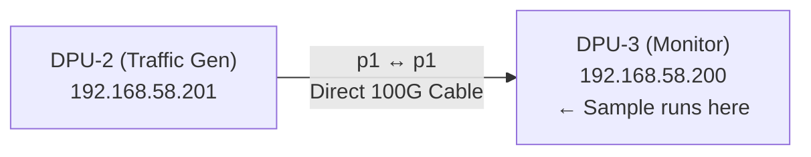
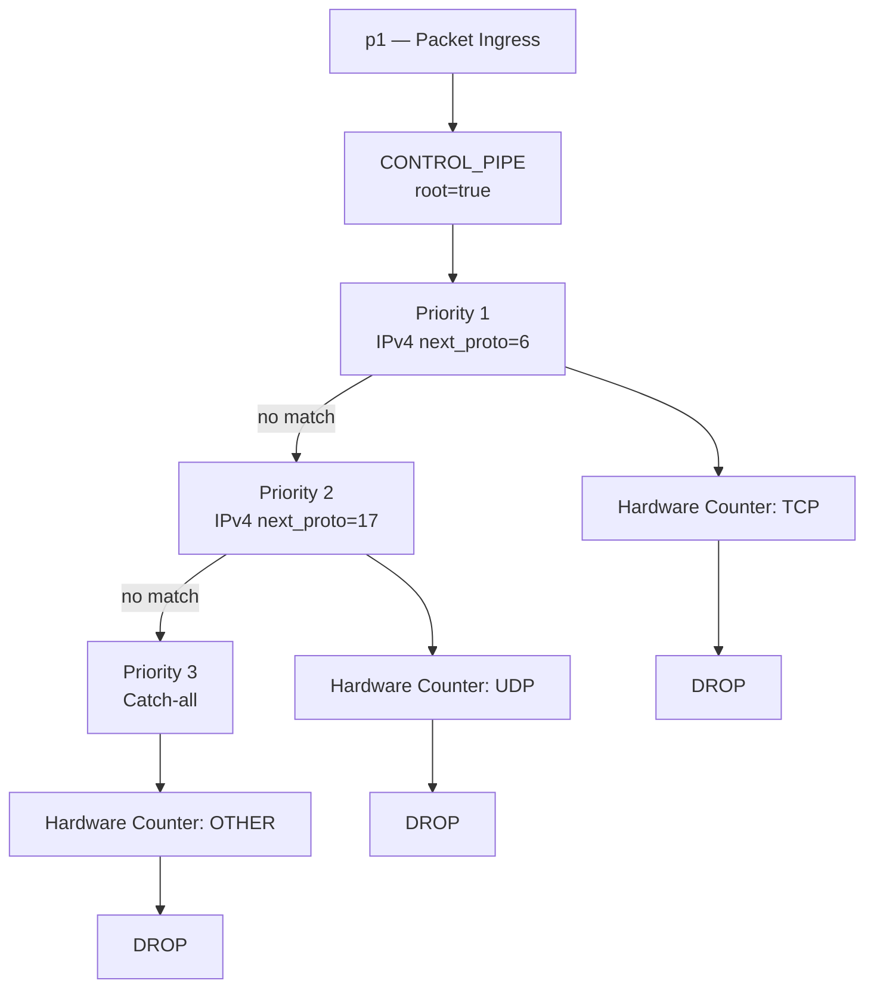
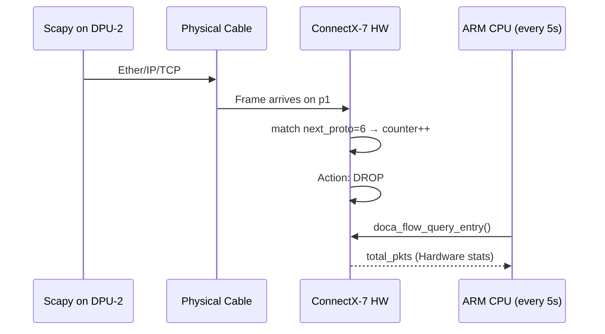

# EXP02 — Packet Counting via DOCA Flow (BlueField-3)

This sample demonstrates how to leverage NVIDIA DOCA Flow on a BlueField-3 DPU to count TCP, UDP, and other protocol packets directly in hardware using the `vnf,hws` (Hardware Steering) mode.

---

## Physical Setup



**Crucial Note:** Traffic must enter through the **physical cable on `p1`**, not via PCIe from the host. If traffic originates from the host, OVS or the Linux kernel might intercept it before it reaches the DOCA Flow hardware pipeline.

---

## How it Works



Every packet is compared against entries in order of priority. Upon the first match: the hardware counter increments, and the packet is dropped. The entire process occurs in silicon, involving zero CPU cycles for forwarding.

### Packet Walkthrough (TCP Example)



---

## Build and Execution

### 1. Compilation
On **DPU-3**, use `meson` and `ninja` to build the application:
```bash
cd /opt/mellanox/doca/samples/doca_flow/flow_count
meson setup build
ninja -C build
```

### 2. Execution (DPU-3 Monitor)
Stop OVS to prevent resource conflicts and launch the sample. The `-a` flag specifies the PCI address for `p1`, and `dv_flow_en=2` enables the Hardware Steering engine.
```bash
sudo systemctl stop openvswitch-switch
sudo ./build/doca_flow_count -a 0000:03:00.1,dv_flow_en=2
```

### 3. Traffic Generation (DPU-2)
Generate traffic from **DPU-2** directly through the `p1` interface:
```python
from scapy.all import *

# Destination MAC must be p1 of DPU-3
dst_mac = "c4:70:bd:86:b8:55"

# Send 500 TCP and 2000 UDP packets
sendp([Ether(dst=dst_mac)/IP(dst="192.168.58.200")/TCP(dport=80)]*500, iface="p1", verbose=False)
sendp([Ether(dst=dst_mac)/IP(dst="192.168.58.200")/UDP(dport=5000)]*2000, iface="p1", verbose=False)
```

**Expected Output:**
```text
[11:05:10][DOCA][INF] Successfully initialized DOCA Flow with HWS
[11:05:15][DOCA][INF] [STATS] TCP: 0    | UDP: 0    | OTHER: 0
[11:05:20][DOCA][INF] [STATS] TCP: 500  | UDP: 2000 | OTHER: 1
[11:05:25][DOCA][INF] [STATS] TCP: 500  | UDP: 2000 | OTHER: 3
```

---

## Project Structure

| File | Responsibility |
|---|---|
| `flow_count_main.c` | DPDK initialization, argument parsing, and resource cleanup. |
| `flow_count_sample.c` | Core logic: Pipe creation, entry installation, and the counter query loop. |
| `flow_common.c/h` | Shared DOCA Flow utilities for port and resource initialization. |
| `meson.build` | Meson build system configuration. |