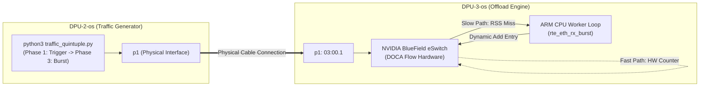
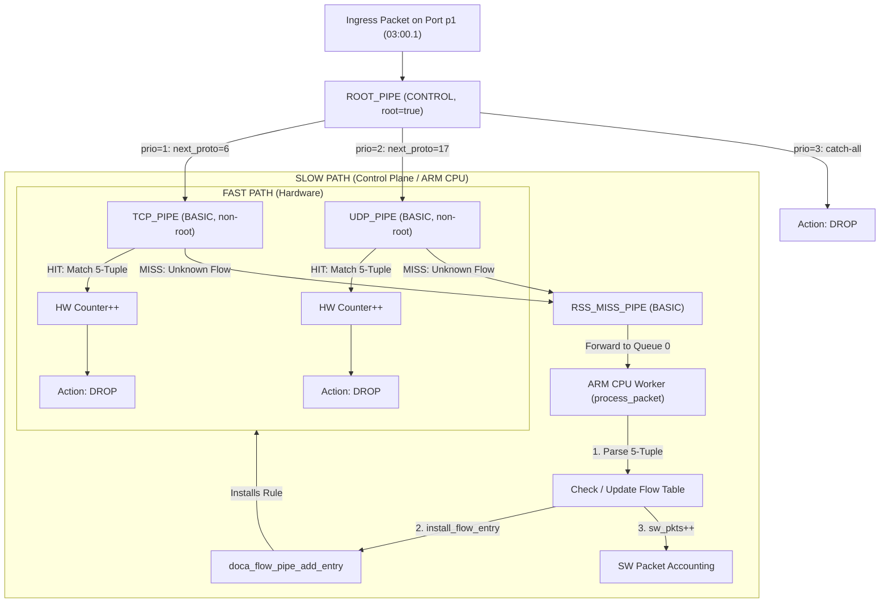

# EXP05: Fast/Slow Path Flow Counting with Dynamic 5-Tuple Hardware Offload

## 📌 Overview
**EXP05** demonstrates an hybrid **Fast-Path / Slow-Path** packet processing engine built with **NVIDIA DOCA Flow** and **DPDK**. 

The goal is to achieve accurate **per-flow counting** using the full 5-tuple (`src_ip`, `dst_ip`, `src_port`, `dst_port`, `protocol`) with zero dropped packets during flow setup:
* **Slow Path**: The first packet of any unmapped flow misses in hardware and is routed to the ARM CPU via an intermediate RSS miss pipe. The CPU logs the flow, initializes software accounting, and dynamically installs an exact-match entry into the hardware eSwitch tables using **Implicit Matching** (mask=NULL).
* **Fast Path**: All subsequent packets hit the newly created hardware rule and are counted directly in hardware counters before being dropped (`DOCA_FLOW_FWD_DROP`), completely bypassing the ARM CPU.

---

## 📐 System Infrastructure Topology

The experiment runs across a multi-node DPU testbed: **DPU-2-os** (acting as the traffic generator) and **DPU-3-os** (acting as the offload target).



---

## 🏗️ Hardware Pipe Architecture & Flow Mechanics

Hardware Steering (HWS) requires a specialized multi-tier pipe setup. Because `fwd_miss` on a Basic Pipe cannot directly forward to RSS in HWS, an intermediate `RSS_MISS_PIPE` bridges miss traffic to CPU Queue 0.



---

## ⚡ Hybrid SW + HW Packet Accounting Model

To guarantee 100% accuracy without losing track of packets received while a hardware rule is committing:

1. **Packet #1 (Trigger)**: Hardware Miss → routed via `RSS_MISS_PIPE` → ARM CPU installs rule → sets `sw_pkts = 1`.
2. **Packet #2..N (Pre-Commit Burst)**: If packets arrive before the hardware table entry finishes committing, CPU recognizes the flow in `flow_table` and increments `sw_pkts++`.
3. **Packet N+1+ (Fast Path)**: Hardware entry becomes active → matched at wire speed → `hw_pkts` counter increments in hardware.

$$\text{Total Packets} = \text{hw\_pkts} + \text{sw\_pkts}$$

---

## 📄 Code Mechanics & Implicit Matching Template

The application sets up `TCP_PIPE` and `UDP_PIPE` using **Implicit Matching** (passing `NULL` for mask), allowing dynamic variable matching across all 5-tuple fields per entry:

```c
struct doca_flow_match match_tmpl = {0};

match_tmpl.outer.l3_type              = DOCA_FLOW_L3_TYPE_IP4;
match_tmpl.outer.l4_type_ext          = DOCA_FLOW_L4_TYPE_EXT_TCP; // or EXT_UDP
match_tmpl.outer.ip4.src_ip           = UINT32_MAX;   // Wildcard variable
match_tmpl.outer.ip4.dst_ip           = UINT32_MAX;   // Wildcard variable
match_tmpl.outer.tcp.l4_port.src_port = UINT16_MAX;   // Wildcard variable
match_tmpl.outer.tcp.l4_port.dst_port = UINT16_MAX;   // Wildcard variable

/* NULL mask enables DOCA Flow Implicit Matching */
doca_flow_pipe_cfg_set_match(cfg, &match_tmpl, NULL);

```

---

## 📂 Source Code Mapping

| File | Function / Role |
| --- | --- |
| `flow_count_main.c` | Program entry point, DPDK/EAL port initialization, signal handling. |
| `flow_count_sample.c` | Builds pipe hierarchy (`ROOT_PIPE`, `TCP_PIPE`, `UDP_PIPE`, `RSS_MISS_PIPE`), runs RX loop, and handles `install_flow_entry()`.

 |
| `flow_common.c` / `.h` | Boilerplate helper functions for DOCA Flow initialization and resource cleanup.

 |
| `traffic_quintuple.py` | Scapy generator executing on **DPU-2-os** to simulate trigger and burst phases. |

---

## 🚀 Build & Execution Guide

### 1. Launch Offload Engine (on `DPU-3-os`)

```bash
cd ~/doca_projects/fast_slow_path-1
meson setup build && ninja -C build
sudo ./build/doca_flow_count -a 0000:03:00.1,dv_flow_en=2

```

### 2. Run Traffic Generator (on `DPU-2-os`)

```bash
sudo python3 traffic_quintuple.py

```

The script operates in 3 distinct phases:

1. **Trigger Phase**: Sends 1 packet per flow followed by a `0.2s` sleep to trigger Slow-Path setup.
2. **Commit Phase**: Waits `3.0s` for full hardware rule insertion.
3. **Burst Phase**: Sends a burst of 20 packets per flow directly into the Fast-Path.

---

## 📊 Expected Output & Dump Reports

When execution terminates (via `Ctrl+C`), the ARM CPU logs the exact flow breakdown and automatically dumps hardware tables to text files:

```text
[SLOW→FAST #0]  192.168.58.201:10000 -> 192.168.58.103:80  TCP
...
==========================================
  REPORT — 100 flussi rilevati
==========================================
[#000] 192.168.58.201:10000 -> 192.168.58.103:80  TCP  total=21 hw=20 sw=1
...
  TOTALE: 100 flussi | 2100 pkts (hw=2000 sw=100)
==========================================
Report for pipe 'tcp_rules' generated: report_tcp_rules.txt
Report for pipe 'udp_rules' generated: report_udp_rules.txt

```

* `report_tcp_rules.txt`: Hardware dump containing the 50 offloaded TCP entries.


* `report_udp_rules.txt`: Hardware dump containing the 50 offloaded UDP entries.


```

```