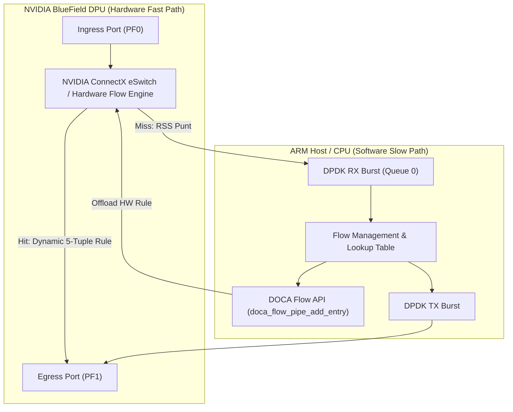
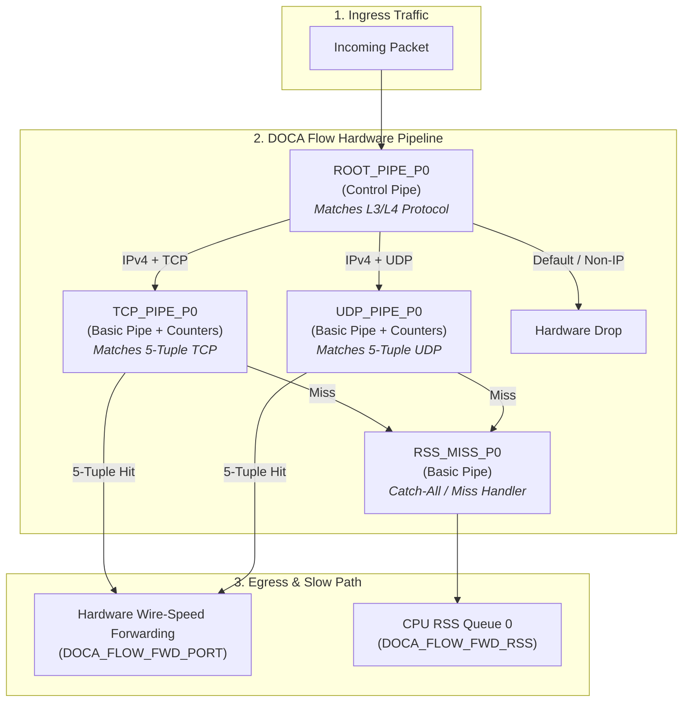
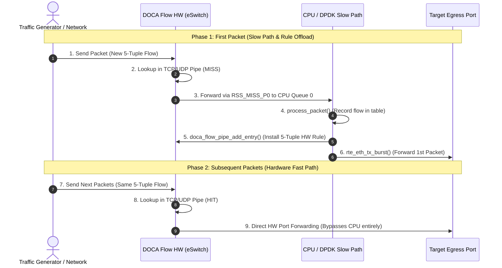

# EXP06: Biridectional sample

## Architecture & Flow Diagrams

### 1. High-Level System Architecture
Thi s diagram illustrates the separation between the **Hardware Fast Path** (NVIDIA ConnectX eSwitch) and the **Software Slow Path** running on the ARM CPU cores.



---

### 2. DOCA Flow Hardware Pipeline Topology

This flowchart details the structural topology of the DOCA Flow pipes created during initialization (`ROOT_PIPE_P0`, protocol-specific 5-tuple pipes, and the RSS fallback pipe).



---

### 3. Packet Lifecycle & Offload Sequence

This sequence diagram shows the step-by-step execution path for a flow's **first packet** versus all **subsequent packets**.




---

## Pipe Specifications

| Pipe Name | Type | Match Fields | Action on Hit | Action on Miss |
| --- | --- | --- | --- | --- |
| **`ROOT_PIPE_P0`** | `CONTROL` | L3 Protocol (IPv4), L4 Protocol | Jump to `TCP_PIPE_P0` / `UDP_PIPE_P0` | Drop non-IP traffic |
| **`TCP_PIPE_P0`** | `BASIC` | 5-Tuple (Src/Dst IP, Src/Dst Port, Proto) | Forward to Egress Port (`FWD_PORT`) | Forward to `RSS_MISS_P0` |
| **`UDP_PIPE_P0`** | `BASIC` | 5-Tuple (Src/Dst IP, Src/Dst Port, Proto) | Forward to Egress Port (`FWD_PORT`) | Forward to `RSS_MISS_P0` |
| **`RSS_MISS_P0`** | `BASIC` | Empty Match (Catch-All) | Forward to CPU Queue 0 (`FWD_RSS`) | N/A |

---

## Building and Running

### Prerequisites

* NVIDIA DOCA SDK installed on DPU
* DPDK environment configured with hugepages enabled
* BlueField DPU running in Switch Devlink mode

### Build

```bash
meson build
ninja -C build
sudo ./build/doca_flow_count -a 0000:03:00.1,dv_flow_en=2,representor=[65535]
```
